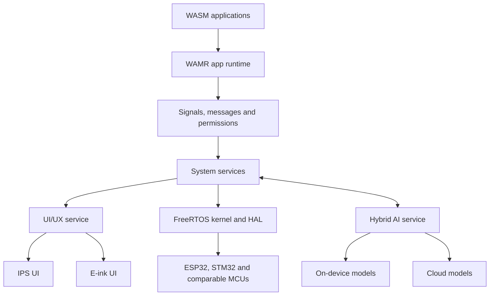

# LalandeOS

**Intelligence, closer to the edge.**

LalandeOS is an AI-native application operating system for small-SoC microcontrollers. It brings a lightweight FreeRTOS foundation, sandboxed WebAssembly applications, message-based system services, and hybrid device-to-cloud AI into one embedded platform.

[English](#overview) · [简体中文](#简体中文) · [한국어](#한국어)

> [!NOTE]
> LalandeOS is in its early development stage. The architecture and interfaces described here are the project direction; runnable releases and build instructions will be added as the implementation matures.

---

## Overview

Embedded products increasingly need third-party applications, secure resource sharing, responsive interfaces, and AI—without the footprint of a mobile or desktop operating system. LalandeOS is designed to provide that application model on constrained hardware.

### Four highlights

1. **Lean by design**: Fast startup, predictable execution, and a footprint suited to small-SoC devices.

2. **Sandboxed by default**: WebAssembly Micro Runtime (WAMR) isolates portable applications from the system and from one another.

3. **A familiar app model**: Signals and messages let isolated applications request system resources through explicit OS services instead of direct hardware access.

4. **AI throughout**: A shared AI layer can route work between local models and flexible cloud models for use by both the OS and applications.

## Architecture

The application layer is separated from hardware-facing services. The OS mediates access through messages and permissions, while the hybrid AI service exposes a consistent interface across local and cloud execution.

## Platform direction

- **RTOS foundation**: FreeRTOS-based core with hardware abstraction for supported MCU families.
- **Application runtime**: Portable WASM applications hosted by WAMR.
- **IPC and services**: Android-inspired signals and messages for brokered access to system capabilities.
- **AI service layer**: Common APIs for on-device inference and configurable cloud models.
- **Display profiles**: A responsive IPS interface and a low-refresh, low-power e-ink interface.
- **Initial hardware focus**: ESP32-S3/S31, ESP32-P4, STM32-F4, and comparable small-SoC microcontrollers.

## Design principles

- **Isolation first**: Applications run with narrowly defined access to OS-managed capabilities.
- **Explicit communication**: Services interact through stable message contracts rather than hidden coupling.
- **Portable applications**: WASM separates app delivery from a single MCU architecture.
- **Edge-aware intelligence**: AI workloads can remain local when practical or use cloud models when appropriate.
- **Interface by medium**: IPS and e-ink experiences share the platform while respecting different refresh, color, and power constraints.

## Roadmap

- [ ] Establish the FreeRTOS platform core and hardware abstraction layer
- [ ] Define the signal, message, service, and permission model
- [ ] Integrate WAMR application loading and lifecycle management
- [ ] Build the hybrid AI service interface
- [ ] Implement IPS and e-ink UI foundations
- [ ] Publish the SDK, examples, build instructions, and developer documentation
- [ ] Release the first runnable developer preview

The roadmap describes direction rather than a delivery schedule and may change as the architecture is validated on target hardware.

## Getting started

The repository is currently at the project-foundation stage. Source-level setup and build commands will be documented after the first runnable baseline is available.

Follow the project at [github.com/yawong0925/lalandeos](https://github.com/yawong0925/lalandeos).

## Contributing

Contribution guidelines will be published with the initial codebase. Until then, architecture feedback and implementation proposals are welcome through the repository.

---

## 简体中文

**智能，更近一步。**

LalandeOS 是一款面向小型 SoC 微控制器的 AI 原生应用操作系统。它以 FreeRTOS 为基础，通过 WAMR 运行相互隔离的 WebAssembly 应用，以信号和消息安全连接系统服务，并为操作系统与应用提供统一的端侧与云端 AI 能力。

核心方向：

- 面向受限硬件的轻量、快速、可预测运行
- 默认使用 WebAssembly 沙盒隔离应用
- 通过消息与权限访问系统资源
- 统一调度本地模型与灵活的云端模型
- 同时支持 IPS 彩屏与低功耗电子墨水屏界面
- 初期聚焦 ESP32-S3/S31, ESP32-P4, STM32F4 及同类 MCU

项目尚处于早期开发阶段。首个可运行版本完成后，将发布构建说明、SDK、示例与开发文档。

---

## 한국어

**가까운 곳에서 시작되는 슈퍼 지능.**

LalandeOS는 소형 SoC 마이크로컨트롤러를 위한 AI 네이티브 애플리케이션 운영체제입니다. FreeRTOS를 기반으로 WAMR를 통한 WebAssembly 앱 격리, 신호와 메시지 기반의 안전한 시스템 서비스 접근, 그리고 OS와 앱이 함께 사용하는 디바이스·클라우드 하이브리드 AI를 하나의 플랫폼으로 제공합니다.

핵심 방향:

- 제한된 하드웨어에 적합한 가볍고 빠르며 예측 가능한 실행
- WebAssembly 샌드박스를 통한 기본 앱 격리
- 메시지와 권한을 통한 시스템 자원 접근
- 로컬 모델과 유연한 클라우드 모델을 연결하는 공통 AI 계층
- IPS 컬러 화면과 저전력 e-ink 화면을 위한 이중 UI 방향
- ESP32-S3/S31, ESP-P4, STM32F4 및 동급 MCU 우선 지원

현재는 초기 개발 단계입니다. 첫 실행 가능 버전이 준비되면 빌드 방법, SDK, 예제와 개발자 문서를 공개할 예정입니다.
