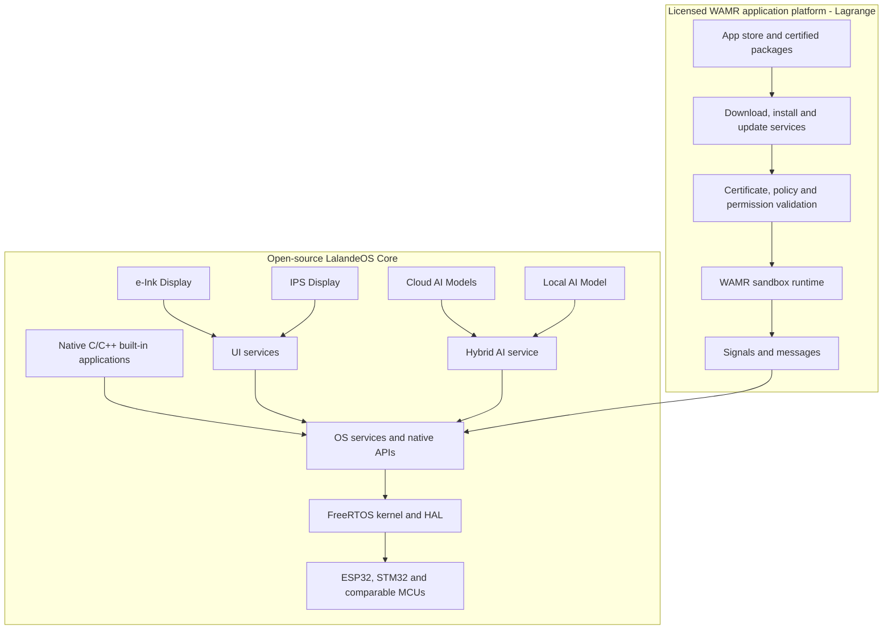

# LalandeOS

**Intelligence, closer to the edge.**

LalandeOS is an AI-native application operating system for small-SoC microcontrollers. It combines a lightweight FreeRTOS foundation, message-based system services, dual application layers, and hybrid device-to-cloud AI in one embedded platform.

[English](#overview) · [简体中文](#简体中文) · [한국어](#한국어)

> [!NOTE]
> LalandeOS is in its early development stage. The architecture, licensing boundary, and interfaces described here are the project direction; runnable releases and build instructions will be added as implementation matures.

---

## Overview

Embedded products increasingly need secure applications, controlled resource sharing, responsive interfaces, and AI without the footprint of a mobile or desktop operating system. LalandeOS is designed to provide that application model on constrained hardware while separating the open OS core from the licensed dynamic-application platform.

### Four highlights

1. **Lean by design**: Fast startup, predictable execution, and a footprint suited to small-SoC devices.

2. **Two application layers**: Native C/C++ firmware applications run directly against OS services, while licensed WAMR applications run in a sandboxed, dynamically managed environment.

3. **Explicit system access**: Signals, messages, permissions, and certificates mediate access to system resources for dynamically installed applications.

4. **AI throughout**: A shared AI layer can route work between local models and flexible cloud models for use by both the OS and applications.

## Application model

LalandeOS separates applications into two distinct layers.

### Native firmware layer

- Native system and product applications are written in C/C++.
- They communicate directly with LalandeOS services through native APIs.
- Device makers compile these applications into the firmware image.
- The open-source core does not include dynamic download, runtime installation, sideloading, or app-store access.

### Licensed WAMR application platform (Lagrange Application Platform)

- Sandboxed WebAssembly applications execute through WAMR.
- The platform adds dynamic download, installation, update, removal, and lifecycle management.
- App-store access is governed by package signing, certificates, permissions, and platform policy.
- This layer, together with LalandeOS certification and related services, is available under a separate commercial license.

Without the licensed application platform, an official LalandeOS Core build runs only the native applications included in its firmware. It does not provide a supported path for end users to download or sideload applications.

## Architecture

The native path remains usable without the licensed platform. The WAMR path is an additional commercial layer that supplies dynamic application delivery and the managed trust chain required for the official LalandeOS app ecosystem.

## Licensing and distribution

The intended distribution model has a clear boundary:

- **LalandeOS Core — open source**: Planned for release under the Apache License 2.0. It includes the OS foundation, hardware abstraction, native C/C++ application APIs, system services, IPC, UI foundations, and AI service interfaces.

- **LalandeOS Application Platform — commercial**: Proprietary LalandeOS components for WAMR integration, dynamic application delivery and lifecycle management, app-store connectivity, signing and certificate validation, certification workflows, and related managed services.

WAMR itself is an independent open-source project distributed under the Apache License 2.0. LalandeOS does not claim ownership of or charge a license fee for WAMR itself. Commercial licensing applies to LalandeOS-developed integration, platform components, certification, services, and associated rights.

> [!IMPORTANT]
> This README describes the intended product boundary; it is not a software license. The license files and commercial agreement shipped with each component will define the actual legal terms.

Because LalandeOS Core is intended to be open source, third parties may modify or extend it under its license. The official LalandeOS store, certificate chain, certification program, and trademarks remain separate from the open-source core.

## Platform direction

- **RTOS foundation**: FreeRTOS-based core with hardware abstraction for supported MCU families.
- **Native application layer**: C/C++ applications compiled into firmware with direct native service access.
- **Licensed WAMR layer**: Sandboxed dynamic applications with managed installation, lifecycle, policy, and store access.
- **IPC and services**: Signals and messages for brokered access from sandboxed applications to system capabilities.
- **AI service layer**: Common APIs for on-device inference and configurable cloud models.
- **Display profiles**: A responsive IPS interface and a low-refresh, low-power e-ink interface.
- **Initial hardware focus**: ESP32-S3/S31, ESP-P4, STM32, and comparable small-SoC microcontrollers.

## Design principles

- **Open core**: Native firmware applications and essential OS services work without the commercial application platform.
- **Explicit trust boundary**: Dynamic applications enter through a managed installer and certificate-based policy checks.
- **Isolation by default**: Store-delivered applications run in the WAMR sandbox rather than as native firmware code.
- **Stable communication**: Sandboxed applications use signals and messages instead of direct hardware access.
- **Edge-aware intelligence**: AI workloads can remain local when practical or use cloud models when appropriate.
- **Interface by medium**: IPS and e-ink experiences share the platform while respecting different refresh, color, and power constraints.

## Roadmap

- [ ] Establish the FreeRTOS platform core and hardware abstraction layer
- [ ] Define native application APIs and the firmware application lifecycle
- [ ] Define the signal, message, service, and permission model
- [ ] Integrate the WAMR sandbox as a separately licensed application platform
- [ ] Design package signing, certificate validation, revocation, and device trust
- [ ] Build dynamic download, installation, update, and removal services
- [ ] Build the hybrid AI service interface
- [ ] Implement IPS and e-ink UI foundations
- [ ] Publish the SDK, examples, build instructions, and developer documentation
- [ ] Release the first runnable developer preview

The roadmap describes direction rather than a delivery schedule and may change as the architecture is validated on target hardware.

## Getting started

The repository is currently at the project-foundation stage. Source-level setup and build commands will be documented after the first runnable baseline is available.

Follow the project at [github.com/yawong0925/lalandeos](https://github.com/yawong0925/lalandeos).

## Contributing

Contribution guidelines will be published with the initial codebase. Until then, architecture feedback and implementation proposals are welcome through the repository. Contributions to the open-source core and access to proprietary platform components will be governed separately.

---

## 简体中文

**智能，更近一步。**

LalandeOS 是一款面向小型 SoC 微控制器的 AI 原生应用操作系统。它以轻量级 FreeRTOS 为基础，通过消息式系统服务、双应用层架构，以及端侧与云端协同的 AI 能力，为嵌入式产品提供完整平台。

### 双应用层

**原生固件层（开放核心）**

- 面向受限硬件的轻量、快速、可预测运行
- 系统应用与产品应用使用 C/C++ 编写，直接调用 LalandeOS 原生服务。
- 设备制造商在构建固件时将应用编译并内置其中。
- 开放核心不提供动态下载、运行时安装、侧载或应用商店接入功能。
- 统一调度本地模型与灵活的云端模型
- 同时支持 IPS 彩屏与低功耗电子墨水屏界面
- 初期聚焦 ESP32-S3/S31, ESP32-P4, STM32F4 及同类 MCU

**WAMR 应用平台（商业授权）**

- WebAssembly 应用在 WAMR 沙盒中运行。
- 通过消息与权限访问系统资源
- 提供动态下载、安装、更新、卸载和生命周期管理。
- 通过签名、证书、权限和平台策略接入官方应用商店。
- 该层以及 LalandeOS 认证与相关服务采用独立商业授权。

### 许可边界

LalandeOS Core 计划采用 Apache License 2.0，涵盖操作系统基础、硬件抽象、原生应用 API、系统服务、IPC、UI 基础和 AI 服务接口。WAMR 本身是采用 Apache License 2.0 的独立开源项目；商业授权针对 LalandeOS 自研的集成、动态应用平台、应用商店连接、签名与证书验证、认证流程及相关服务，而不是对 WAMR 本身收费。

本 README 仅说明计划中的产品边界。各组件附带的许可证文件和商业协议将定义实际法律条款。

项目目前处于早期开发阶段。首个可运行版本完成后，将发布构建说明、SDK、示例与开发者文档。

---

## 한국어

**가까운 곳에서 시작되는 슈퍼 지능.**

LalandeOS는 소형 SoC 마이크로컨트롤러를 위한 AI 네이티브 애플리케이션 운영체제입니다. 가벼운 FreeRTOS 기반, 메시지 중심 시스템 서비스, 이중 애플리케이션 계층, 그리고 디바이스·클라우드 하이브리드 AI를 하나의 임베디드 플랫폼으로 제공합니다.

### 이중 애플리케이션 계층

**네이티브 펌웨어 계층(오픈 코어)**

- 제한된 하드웨어에 적합한 가볍고 빠르며 예측 가능한 실행
- 시스템 앱과 제품 앱은 C/C++로 작성하며 LalandeOS 네이티브 서비스를 직접 사용합니다.
- 디바이스 제조사가 앱을 펌웨어 이미지에 컴파일해 내장합니다.
- 오픈 코어에는 동적 다운로드, 런타임 설치, 사이드로딩 또는 앱 스토어 접속 기능이 포함되지 않습니다.
- 로컬 모델과 유연한 클라우드 모델을 연결하는 공통 AI 계층
- IPS 컬러 화면과 저전력 e-ink 화면을 위한 이중 UI 방향
- ESP32-S3/S31, ESP-P4, STM32F4 및 동급 MCU 우선 지원
**WAMR 애플리케이션 플랫폼(상용 라이선스)**

- WebAssembly 앱은 WAMR 샌드박스에서 실행됩니다.
- 메시지와 권한을 통한 시스템 자원 접근
- 동적 다운로드, 설치, 업데이트, 제거 및 수명 주기 관리를 제공합니다.
- 서명, 인증서, 권한, 플랫폼 정책을 통해 공식 앱 스토어에 접속합니다.
- 이 계층과 LalandeOS 인증 및 관련 서비스는 별도의 상용 라이선스로 제공됩니다.

### 라이선스 경계

LalandeOS Core는 Apache License 2.0으로 공개할 계획입니다. 여기에는 OS 기반, 하드웨어 추상화, 네이티브 C/C++ 앱 API, 시스템 서비스, IPC, UI 기반 및 AI 서비스 인터페이스가 포함됩니다.

WAMR 자체는 Apache License 2.0으로 배포되는 독립 오픈소스 프로젝트입니다. 상용 라이선스는 WAMR 자체가 아니라 LalandeOS가 개발한 통합 코드, 동적 애플리케이션 플랫폼, 앱 스토어 연결, 서명 및 인증서 검증, 인증 절차와 관련 서비스에 적용됩니다.

이 README는 계획된 제품 경계를 설명하며 소프트웨어 라이선스 자체가 아닙니다. 실제 법적 조건은 각 구성 요소에 포함된 라이선스 파일과 별도 상용 계약으로 정해집니다.

현재는 초기 개발 단계입니다. 첫 실행 가능 버전이 준비되면 빌드 방법, SDK, 예제와 개발자 문서를 공개할 예정입니다.
